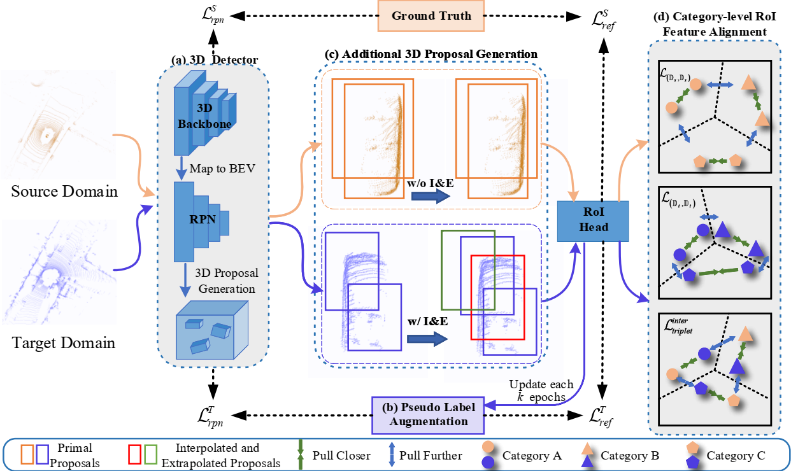

# PERE

Code release for the paper **Pseudo Label Refinery for Unsupervised Domain Adaptation on 3D Object Detection**.

## Introduction
Our code is based on OpenPCDet v0.3.0.
More updates on OpenPCDet are supposed to be compatible with our code.

## Installation

Please refer to [INSTALL.md](docs/INSTALL.md) for the installation.

## Getting Started

Please refer to [GETTING_STARTED.md](docs/GETTING_STARTED.md) to learn more usage about this project.

### Supported features and ToDo List

- [x] Support inference and pre-trained model 

- [x] Support training code on Waymo -> KITTI task

- [x] Update to OpenPCDet v0.3.0 version.
  
- [x] Support more adaptation tasks.

## License

Our code is released under the Apache 2.0 license.

## Acknowledgement

Our code is heavily based on [OpenPCDet v0.3](https://github.com/open-mmlab/OpenPCDet) and [ST3D](https://github.com/CVMI-Lab/ST3D). 
We appreciate all the contributors for their awesome work.

